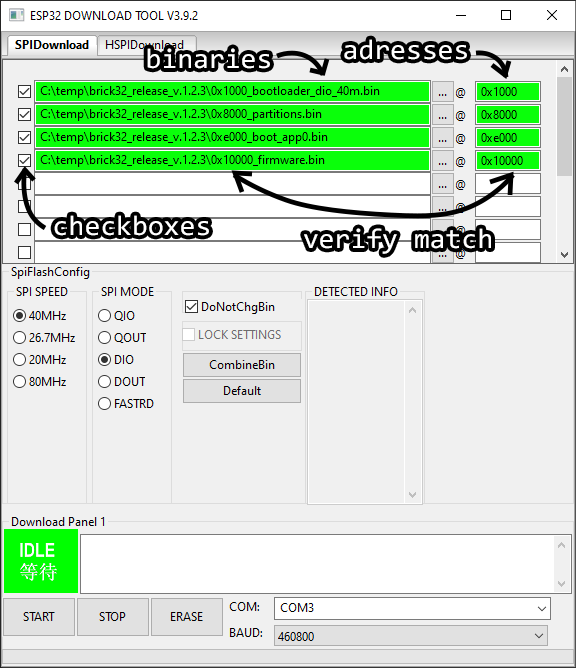

# Brick 32

This repo is an alternate firmware for the Sonoff Origin producs (TH Origin THR316/THR320, TH Elite THR316D) to turn them into a brewing control (mashing and fermentation). The relay can be configured to control heating, cooling, agitation and pumps. The DS18B20 sensor supplies the temperature reading. After flashing, they can be added as a "Brick" on [BierBot Bricks](https://bricks.bierbot.com) allowing a whole range of features:

- Super easy setup and easy to try out.
- Android app and Web app available, iOS coming soon.
- Various kettle setups supported: BIAB, RIMS, HERMS.
- Free, open source license (GPL-v3)
- PDI controller that works with a simple and cheap non PWM/SSR relay and yet eliminates temperature overshoots.
- Mashing controller and fermentation controller, both with automatic timer control.
- Multi-language (German, English, Portugese, [tell us](https://bierbot.com/contact/) if you want to help!)
- Integrated recipe management: Set the temperature, the time, etc.
- Integrated logging: See your temperature log during the mash and export a PDF after brewing
- User authentication
- Access from everywhere
- Found a brewery and invite friends to share equipment, recipes, etc.
- Works perfectly on any Smartphone, Tablet, PC or Mac (or any web browser).
- Beer.XML import
- Configurable units for temperature (Celsius/Fahrenheit), gravity (°Plato, specific gravity), volume (Liters, Gallons), weight (Grams, pounds) etc.
- Control agitators, pumps, valves.
- Missing something❓  [tell us!](https://github.com/BernhardSchlegel/Brick-32/issues) 🗨️

If you want to use a **RaspberryPi** and do all the wiring/electronics yourself, [please head over here](https://github.com/BernhardSchlegel/BierBot-Bricks-RaspberryPi).

## Images

## Manual

### Hardware

This software is tailor made for the Sonoff TH Origin (16A and 20A versions). Other, similar ESP32 powered Sonoff devices (POW Origin, POW Elite, etc.) will most likely work, too.

### Build guide

A detailled build guide can be found on [YouTube](https://www.youtube.com/watch?v=5TI9fxsTRmM) and on the [BierBot blog](https://bierbot.com/blog/tutorial-easy-brewing-control-build/). Feel free to check it out, if the following explanation is not detailled enough.

1. Read disclaimer below!
1. Open housing by unscrewing all 4 screws.
1. Solder 4 pins to the Terminal (3V3, GND, TX, RX).
1. connect rainbow cable, route to outside.
1. Connect to USB-to-serial adapter as show above.
1. Download the latest release from [here](https://github.com/BernhardSchlegel/Brick-ESP32/releases/latest), i.e. "brick32_release_v.X.Y.Z.zip" (X, Y, and Z being placeholders).
1. Unzip the file to a folder.
1. Flash the software using the official "Flash Download Tool" [available here](https://espressif.com/en/support/download/other-tools).
   1. Unzip the tool, and open the "flash_download_tool_3.9.2.exe" (or similar) in the root folder.
   1. In the dialog, set chipType dropdown to "ESP32", workmode to "develop", hit OK.
   1. Refer the below image of all necessary adjustments:
     1. Select the four binaries in the order shown. Select the respective addresses (starting with `0x`) on the right. Check all checkboxes to  the right of the filenames. Make sure the beginning of the filename (i.e. `0x8000_`) matches the address on the right (i.e. `0x8000`) for  each respective row. 
     1. Select "SPI SPEED" of "40MHz" (should be the default), 
     1. "SPI MODE" to "DIO" (should be the default", 
     1. check "DoNotChgBin". At the bottom select the COM port (to figure out which one is your USB to serial converter, simply unplug and plug it  back it), i.e. "COM3", 
     1. set "BAUD" to "460800".
1. Disconnect the (mini) USB cable to your Serial Converter. Now: HOLD the button on the Sonoff, insert the USB cable (while still holding the button), and release the Button on the Sonoff again.
1. Hit "START" (lower-right corner) of the flashing tool. Wait for the process to complete. If it fails: Make sure all rainbow cables are attached correctly, close and re-start the flashing tool.
1. Power up, and connect to the hotspot (see [Usage-Section](#Usage)).

### Usage

Simply power up your BierBot Brick-32 and use any WiFi enabled device (Android, iPhone, Tablet, Mac, or PC) to scan for a Brick-32-Wifi (i.e. `Brick-32-0042123`) to configure your Brick. You'll need an API key which you can get for free at [bricks.bierbot.com](https://bricks.bierbot.com).

### Buttons and LEDs

The following Buttons are available

- Main-Button (top-left corner, blue LED)
  - Short Press / Click: Loop through array modes:
    1. Auto-Control by Software
    2. Force-OFF
    3. Force-ON
  - Double Press: bring up WiFi configuration portal
  - Long Press (more than 3s) factory reset.

The following LEDs are available to tell you which state your Brick-32 is in:

- Power-LED (red): On as soon the Brick is supplied with power and done with booting. This LED will confirm launching config portal with 3 Flashes and a Factory Reset with 10 flashes.
- WiFi-LED (blue): On if WiFi connection was established.
- Auto-Relay-LED (yellow):
   - Blinking: Relay is under automatic software control (if the LED is on the majority of the Blink, relay is ON. If the LED is off during marjority of the blink, relay is OFF).
   - Off: Relay is off due to force-override.
   - On: Relay is on due to force-override.

## Troubleshooting

Q: My COM port is not recognized? 
A: Download and install [the official drivers from here.](https://ftdichip.com/drivers/vcp-drivers/)

## For Developers :heart:

Refer the [Developer Readme](./docs/DEV.MD).

## Disclaimer

:warning: **DANGER OF ELECTROCUTION** :warning:

If your device connects to mains electricity (AC power) there is danger of electrocution if not installed properly. If you don't know how to install it, please call an electrician (***Beware:*** certain countries prohibit installation without a licensed electrician present). Remember: _**SAFETY FIRST**_. It is not worth the risk to yourself, your family and your home if you don't know exactly what you are doing. Never tinker or try to flash a device using the serial programming interface while it is connected to MAINS ELECTRICITY (AC power).

We don't take any responsibility nor liability for using this software nor for the installation or any tips, advice, videos, etc. given by any member of this site or any related site.

[disclaimer source](https://github.com/arendst/Tasmota/edit/development/README.md)
