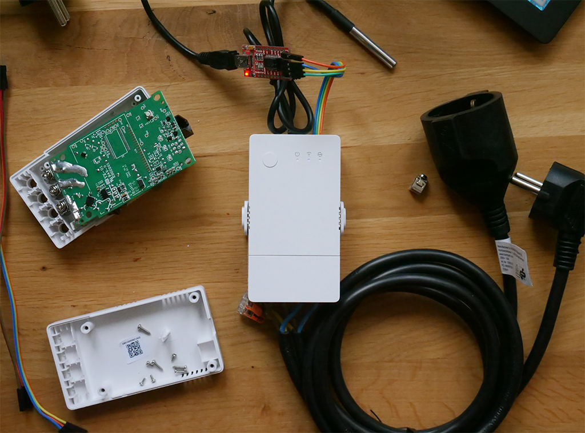
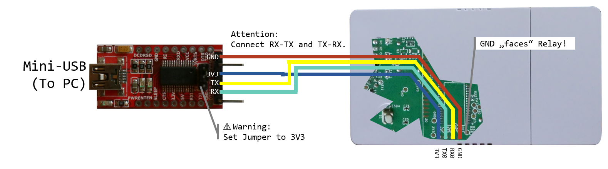

# BierBot Brick ESP32

## Manual

### TODOs

- [ ] cleanup code
- [ ] detail flashing process

### Hardware

This software is tailor made for the Sonoff TH Origin (16A and 20A versions). Other, similar ESP32 powered Sonoff devices (POW Origin, POW Elite, etc.) will most likely work, too.

### Build guide

1. Read disclaimer below!
1. Open housing by unscrewing all 4 screws.
1. Solder 4 pins to the Terminal (3V3, GND, TX, RX).
1. connect rainbow cable, route to outside.
1. Connect to USB-to-serial adapter as show above.
1. Flash the software using tool of your choice.
1. Power up, and connect to the hotspot (see Usage-Section).

### Usage

Simply power up your BierBot Brick-32 and use any WiFi enabled device (Android, iPhone, Tablet, Mac, or PC) to scan for a Brick-32-Wifi (i.e. `Brick-32-0042123`) to configure your Brick.

### Buttons and LEDs

The following Buttons are available

- Main-Button (top-left corner, blue LED)
  - Short Press / Click: Loop through array modes:
    1. Auto-Control by Software
    2. Force-OFF
    3. Force-ON
  - Double Press: bring up WiFi configuration portal
  - Long Press (more than 3s) factory reset.

The following LEDs are available to tell you which state your Brick-32 is in:

- Power-LED (red): On as soon the Brick is supplied with power and done with booting. This LED will confirm launching config portal with 3 Flashes and a Factory Reset with 10 flashes.
- WiFi-LED (blue): On if WiFi connection was established.
- Auto-Relay-LED (yellow):
   - Blinking: Relay is under automatic software control (if the LED is on the majority of the Blink, relay is ON. If the LED is off during marjority of the blink, relay is OFF).
   - Off: Relay is off due to force-override.
   - On: Relay is on due to force-override.

## Dev FAQs

### General

Q: COM port not recognized:
A: Install the CP2102 USB to UART Bridge Controller driver from [here](https://www.silabs.com/developers/usb-to-uart-bridge-vcp-drivers)

Q: Startup during debugging fails, message is `rst:0x1 (POWERON_RESET),boot:0x13 (SPI_FAST_FLASH_BOOT)`?
A: Not enough power: The COM-Adapter is not able to provide it. As soon as you use WiFi you need to provide additional power, i.e. using AC.

## Disclaimer

:warning: **DANGER OF ELECTROCUTION** :warning:

If your device connects to mains electricity (AC power) there is danger of electrocution if not installed properly. If you don't know how to install it, please call an electrician (***Beware:*** certain countries prohibit installation without a licensed electrician present). Remember: _**SAFETY FIRST**_. It is not worth the risk to yourself, your family and your home if you don't know exactly what you are doing. Never tinker or try to flash a device using the serial programming interface while it is connected to MAINS ELECTRICITY (AC power).

We don't take any responsibility nor liability for using this software nor for the installation or any tips, advice, videos, etc. given by any member of this site or any related site.

[disclaimer source](https://github.com/arendst/Tasmota/edit/development/README.md)
